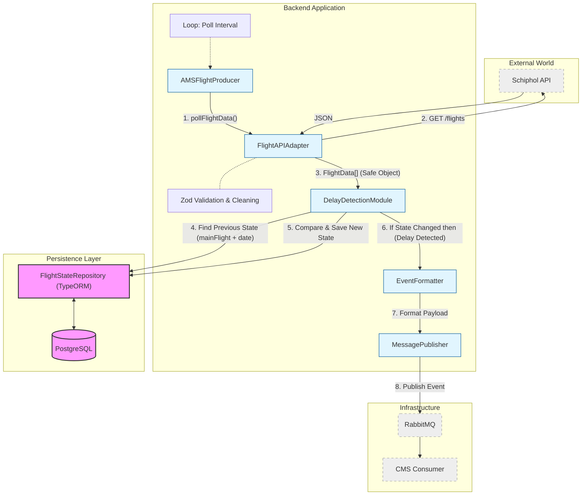
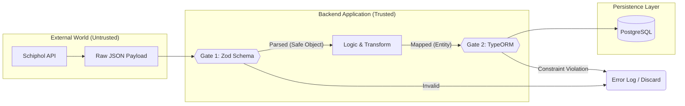

# Project Structure

## Directory Structure

Given the complexity of the project, the directory structure is as follows:

```
ams-flight-ingestion
├── src
│   ├── config
│   │   └── flight-schema.ts
│   ├── core
│   │   ├── entities
│   │   │   └── FlightState.ts
│   │   └── repositories
│   │       └── FlightStateRepository.ts
│   ├── services
│   │   └── SchipholService.ts
│   └── index.ts
├── test
│   └── config
│       └── flight-schema.test.ts
├── .env
├── .env.example
├── architecture.md
├── README.md
├── docker-compose.yml
├── Dockerfile
├── package.json
├── tsconfig.json
└── yarn.lock
```

## Data Flow Overview

### Backend Class Diagram

The Backend Class Diagram is designed as follows:



### TypeScript Code Flow

The Backend Code Flow corresponding to the Backend Class Diagram is designed as follows such that the SoC and IoC principles are adhered to.

1. **Gate 1: Input Validation by `Zod`**

    Responsible for validating and converting the untrusted `Raw JSON` into a clean `TypeScript Object`. If the format is incorrect, it will be discarded here.

2. **The Transformation Layer for Business Logic**

    Receives the clean object, performs business operations (e.g., calculating delay time, filtering duplicate data), and assembles it into a `TypeORM Entity` that matches the database structure.

3. **Gate 2: Persistence Constraints by TypeORM**

    Responsible for executing SQL writes. At this stage, it checks database-level constraints, such as Primary Key conflicts and Foreign Key associations, to ensure database integrity.


